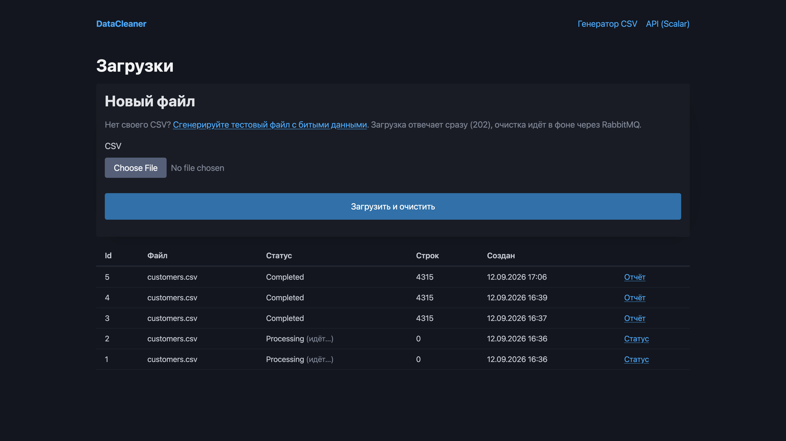
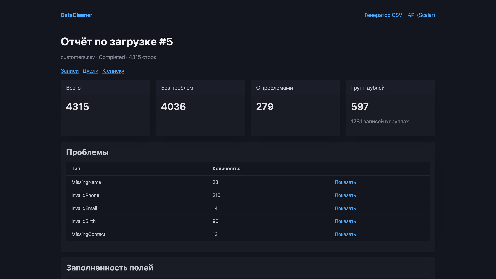
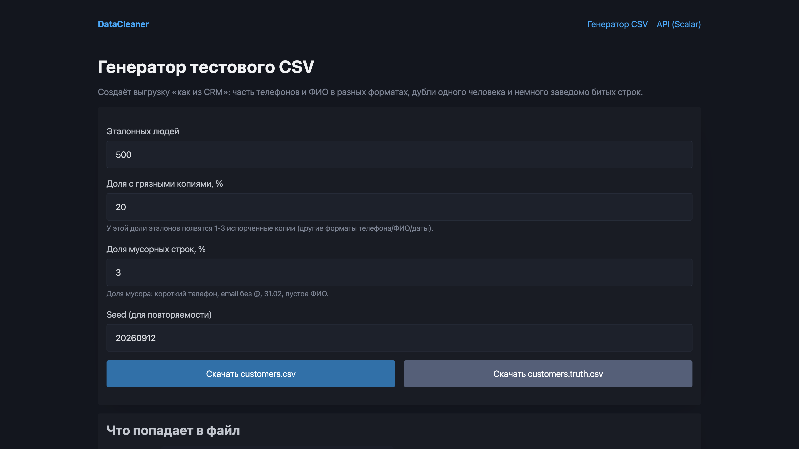

# DataCleaner

ASP.NET Core service that cleans CRM customer exports. You upload a CSV with messy phones, names, emails and dates; the service normalizes each row, flags quality issues, finds duplicates and shows a quality report.

The same business logic is exposed two ways: a **Minimal API** (for integrations, documented in Scalar) and a simple **MVC UI** (for a human). Heavy work runs in the background through **RabbitMQ**, so upload returns immediately with `202 Accepted` while normalization and deduplication continue asynchronously.

> Built over several evenings while switching from Node.js/NestJS to .NET.

## Run

```bash
docker compose up -d
dotnet ef database update --project src/DataCleaner.Api
dotnet run --project src/DataCleaner.Api --launch-profile http
```

Then open:

- UI: http://localhost:5262/
- CSV generator: http://localhost:5262/Samples
- API docs (Scalar): http://localhost:5262/scalar
- RabbitMQ console: http://localhost:15672 (guest/guest)

Upload `samples/customers.csv` from the repo, or generate a dirty file on `/Samples`.

Tests:

```bash
dotnet test
```

## Architecture

All domain logic lives in services (`ImportService`, normalizers, `DeduplicationService`, `QualityReportService`). Minimal API endpoints, MVC controllers and the RabbitMQ `BackgroundService` are thin adapters over those services, wired through DI.

```
POST /api/imports  →  AcceptAsync (save file, Pending, publish)
                          │
                          ▼
                     RabbitMQ queue "imports"
                          │
                          ▼
               ImportProcessor (BackgroundService)
                          │
                          ▼
                     ProcessAsync (normalize → save → dedupe → Completed)
```

`BackgroundService` is a singleton; `DbContext` / `ImportService` are scoped. The consumer creates an `IServiceScope` per message so scoped services are not captured by the singleton.

## Screenshots







## Data model

| Table | Purpose |
|---|---|
| `import_batches` | One row per uploaded file: status, path on disk, totals, errors |
| `customer_records` | One CSV row: raw fields + normalized fields + `QualityIssues` flags |
| `duplicate_groups` | Sets of records treated as one person, with match reason |

Raw and cleaned values are stored side by side so you can always see what came in and what the service produced.

## Normalization (short)

- **Phone (RU):** digits only; `8…` → `7…`; 10-digit mobile gets leading `7`; valid result is `+7XXXXXXXXXX`
- **Name:** trim, collapse spaces, title-case (incl. hyphen parts), split Last / First / Middle
- **Email:** trim, lower-case, `MailAddress.TryCreate` + dot in domain
- **Birth date:** `dd.MM.yyyy`, `yyyy-MM-dd`, `dd/MM/yyyy`, `d.M.yyyy`; reject future and pre-1900
- **City:** strip leading/trailing `г.`, title-case

Empty phone/email is allowed; garbage sets the matching `QualityIssues` flag. `MissingContact` means both phone and email are absent after normalization.

## Deduplication

Exact matches only (for now):

1. Union-Find over records in one batch
2. Link by normalized phone, then by email
3. Transitive chains (`A`–`B` by phone, `B`–`C` by email) become one group
4. `MatchReason`: `phone`, `email`, or `phone+email`

## Async processing and reliability

- Upload saves the CSV under `./uploads`, creates `ImportBatch` with `Pending`, publishes `{ batchId }` and returns **202**
- Queue is **durable**; messages are **persistent**; consumer uses **manual ack** and `prefetch=1`
- On success → `BasicAck`; on failure → status `Failed` and `BasicNack(requeue: false)`
- Idempotency: if the batch is already `Completed`, a redelivered message is ignored
- A proper next step is a **dead letter exchange** for failed messages (not implemented yet)

## Example quality report

On `samples/customers.csv` (~4315 rows):

| Metric | Value |
|---|---|
| Total records | 4315 |
| Clean | 4036 |
| With issues | 279 |
| InvalidPhone | 215 |
| MissingContact | 131 |
| InvalidBirth | 90 |
| MissingName | 23 |
| InvalidEmail | 14 |
| Duplicate groups | 597 |
| Records in groups | 1781 |

## API

| Method | Path | Notes |
|---|---|---|
| `POST` | `/api/imports` | `202 Accepted`, body has batch id/status |
| `GET` | `/api/imports/{id}` | Status / summary |
| `GET` | `/api/imports/{id}/report` | Quality report |
| `GET` | `/api/imports/{id}/records` | `?issue=&page=` |
| `GET` | `/api/imports/{id}/duplicates` | Groups with records |

## Limitations / next steps

- No fuzzy matching on names (Jaro–Winkler inside birth-date blocks would help)
- Name order «Имя Фамилия» and initials are not handled
- Failed queue messages are dropped (`requeue: false`) — add a DLQ
- Bulk insert / `COPY` for multi-million row files
- Several parallel consumers for throughput
- UI status refresh is a simple meta-refresh; production would use SignalR or JS polling

## Stack

.NET 10, ASP.NET Core (Minimal API + MVC), EF Core + PostgreSQL 17, RabbitMQ 4, CsvHelper, xUnit.
